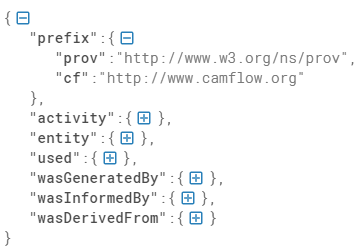

amflow Concepts

In a computing context, data provenance represents, in a formal manner, the relationships between data items (entities), transformations applied to those items (activities), and persons or organisations associated with the data and transformations (agents).

- A provenance graph represents entities, activities and agents. 
- At the OS level, entities are typically kernel data objects: files, messages, packets etc., but also xattributes, inode attributes, exec parameters, network addresses etc.  
- Activities are typically processes carrying out manipulations on entities. 
- Agents are persons or organisations (e.g., users, groups etc.) on whose behalf the activities operate. 
- In the provenance graph, all these elements are nodes, connected by edges representing different types of interactions.

## Analyzing Camflow Output

Count the number of lines in a Camflow output file 

```
wc trace.data
```

Read output file line by line
```
sed -n 1p trace.data (line 1) 
sed -n 2p trace.data (line 2)
```

The output generated by camflowd supports two formats: W3C PROV-JSON format and the SPADE JSON format. SPADE JSON is CamFlow default output. Try to understand the Camflow output (JSON).

To understand the JSON output, use the [JSON code beautify](https://codebeautify.org/jsonviewer)

A sample output is shown below:

[//]: 

   

It will help to understand the JSON format output in a structured way. In the JSON viewer, we will able to obtain the following information:

Now, the `JSON output` can contain

- Vertices
  - entity
  - activity
- Edges
  - used
  - wasGeneratedBy
  - wasDerivedFrom

A sample output of Entity is

```
"cf:AAAIAAAAACBQ8wAAAAAAAAEAAADE+3Y2AAAAAAAAAAA=":{
    "cf:id":"62288",
    "prov:type":"path",
    "cf:boot_id":1,
    "cf:machine_id":"cf:913767364",
    "cf:version":0,
    "cf:date":"2019:03:22T13:17:40",
    "cf:jiffies":"4294724646",
    "cf:epoch":0,
    "cf:pathname":"/usr/lib/x86_64-linux-gnu/libgobject-2.0.so.0.5600.2",
    "prov:label":"[path] /usr/lib/x86_64-linux-gnu/libgobject-2.0.so.0.5600.2"
},
```

- `cf:AAAIAAAAACBQ8wAAAAAAAAEAAADE+3Y2AAAAAAAAAAA=` represents the hash of the data structure i.e. everything in between `{` and `}`.
-  If we want to count the number of vertex in the `trace.data` mainly count the number of unique `cf:id`.
- The count of `cf:id` and the `hash of the data structure` should be equal. The number of different hashes should be the same as the number of nodes (which may include nodes of different versions).
- Each line of camflow output represents a bunch of data (nodes/edges).

The Vertices can have different types `prov:type` defined in [Vertices](https://github.com/CamFlow/camflow-dev/blob/master/docs/VERTICES.md)

```
file, task, pipe, directory, socket, path etc. 
```

The sample output of Edges is
```
cf:gAAAAAAAQIACAAAAAAAAAAEAAADE+3Y2AAAAAAAAAAA=":{
        "cf:id":"2",
        "prov:type":"memory_write",
        "cf:boot_id":1,
        "cf:machine_id":"cf:913767364",
        "cf:date":"2019:03:22T13:17:40",
        "cf:jiffies":"4294724256",
        "cf:epoch":0,
        "prov:label":"memory_write",
        "cf:allowed":"true",
        "prov:activity":"cf:AQAAAAAAAEDW8QAAAAAAAAEAAADE+3Y2AAAAAAAAAAA=",
        "prov:entity":"cf:AAAACAAAACDV8QAAAAAAAAEAAADE+3Y2AAAAAAAAAAA=",
        "cf:flags":"0"
}
```
    
The Relations (Edges) also have variour types of `prov:type` supported by [Camflow](https://github.com/CamFlow/camflow-dev/blob/master/docs/RELATIONS.md)

```
read, write, unknown, setuid, connect, open etc
```

